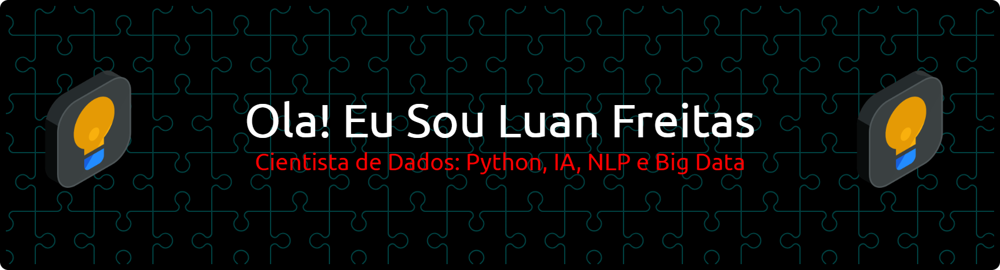

  

  

  

  

-   🔭 Atualmente estou trabalhando em

-   🌱 Atualmente estou aprendendo **Inteligência Generativa e Computação em Nuvem**

-   👯 Procuro colaborar em **Em áreas importantes como finanças, educação e entre outras**

-   🤝 Procuro ajuda com **Novos desafios**

-   💬 Pergunte-me sobre **Ciência de dados e aprendizado de máquina**

-   📫 Como entrar em contato comigo **luan.mgf@gmail.com**

-   ⚡ Curiosidade **Sou apaixonado por aprender coisas novas da área de TI todos os dias!**

-   📄 Saiba mais sobre minhas experiências **[Linkedin](https://www.linkedin.com/in/luanfreitas5/)**

<h3 align="left">Conecte-se comigo:</h3>

<h3 align="left">Languages and Tools:</h3>

                          

&nbsp;

**"A tecnologia é melhor quando aproxima as pessoas"** 💙

