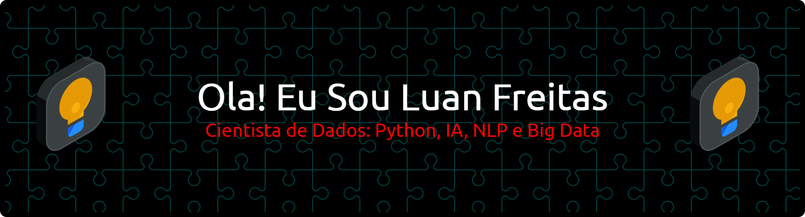

  

<h1 align="center">Luan Freitas</h1>

  <strong>Cientista de Dados · Engenheiro de Inteligência Artificial</strong> 
  Machine Learning aplicado, MLOps, NLP em português e IA Responsável 
  Bacharel em Ciência da Computação — Universidade de Brasília (UnB)

  
  
  
  
  

  

---

## 👋 Sobre mim

Construo **sistemas de machine learning que sobrevivem fora do notebook**: pipelines reprodutíveis,
contratos de dados validados, métricas honestas com intervalo de confiança e modelos servidos via API
ou dashboard. Meu foco está na interseção entre **rigor científico e engenharia de software**.

- 🔭 Trabalhando em um **portfólio de projetos ponta a ponta** em ML aplicado, MLOps e NLP em português
- 🌱 Aprofundando em **IA Generativa (LLMs locais e RAG)** e **Computação em Nuvem**
- 🧠 Interesses: **IA Responsável** — explicabilidade (SHAP), calibração de probabilidades e auditoria de fairness
- 👯 Aberto a colaborações em **saúde, finanças, educação e pesquisa aplicada**
- 💬 Pergunte-me sobre **ciência de dados, aprendizado de máquina e NLP em pt-BR**
- 📫 Contato: **luan.mgf@gmail.com** · [LinkedIn](https://www.linkedin.com/in/luanfreitas5/)

  

---

## 🚀 Projetos em destaque

Cinco projetos ponta a ponta, cada um cobrindo um pilar diferente do ciclo de vida de ML —
de explicabilidade de negócio a MLOps de produção, fairness, benchmark científico e LLMs locais.

| Projeto | Problema | Diferencial técnico | Stack principal |
|---|---|---|---|
| **[🔮 Previsão de Churn Explicável](https://github.com/luanfreitas5/previsao-churn-explicavel)** | Identificar clientes com risco de não recomprar no marketplace Olist | SHAP traduzido para linguagem de negócio + auditoria de fairness por UF | `Polars` `LightGBM` `SHAP` `Fairlearn` `MLflow` `Streamlit` |
| **[🛡️ MLOps — Detecção de Fraude](https://github.com/luanfreitas5/mlops-deteccao-fraude)** | Fraude em ~284k transações com desbalanceamento extremo (~0,17%) | Ciclo MLOps completo: DVC + MLflow + API + CI/CD, com limiar sensível a custo | `XGBoost` `DVC` `MLflow` `FastAPI` `Docker` `GitHub Actions` |
| **[⚖️ Risco de Diabetes com Fairness](https://github.com/luanfreitas5/risco-diabetes-fairness)** | Triagem de risco de diabetes a partir do BRFSS 2015 (~253k respostas) | Calibração de probabilidade + auditoria de subgrupos + Model Card e Datasheet | `LightGBM` `Fairlearn` `SHAP` `Streamlit` `Plotly` |
| **[📊 Benchmark de Sentimento pt-BR](https://github.com/luanfreitas5/sentimento-ptbr-benchmark)** | BERTimbau realmente supera baselines clássicos? E generaliza entre domínios? | Avaliação *cross-dataset* N×N com gap de generalização e teste de McNemar | `BERTimbau` `Transformers` `scikit-learn` `MLflow` `uv` |
| **[🤖 Emoção em Tweets com LLM Local](https://github.com/luanfreitas5/tweets-emocao-llm-local)** | Emoção e tópicos em ~800k tweets em português | Arquitetura híbrida: Python calcula, LLM local **apenas** redige a explicação | `BERTopic` `Ollama` `Llama 3.1` `FastAPI` `Pydantic` |

<b>📖 Ver detalhamento de cada projeto</b>

 

### 🔮 [previsao-churn-explicavel](https://github.com/luanfreitas5/previsao-churn-explicavel) — Churn explicável no e-commerce brasileiro

**Problema de negócio.** No dataset público da Olist, a maioria dos clientes compra uma única vez.
Prever quem não voltará é um problema desbalanceado e com alto risco de vazamento temporal.

**Abordagem.** Features **RFM** (recência, frequência, valor) calculadas exclusivamente sobre o
histórico anterior ao *cutoff*, evitando vazamento por construção. Modelo **LightGBM** dentro de um
`Pipeline` do scikit-learn com balanceamento de classes.

**Rigor de avaliação.** Métrica principal **PR-AUC** (*Average Precision*) com **IC 95% via bootstrap**,
comparação contra baseline, análise de calibração (**Brier score**) e avaliação de fairness por estado
(UF) com `fairlearn`.

**Entrega.** Dashboard **Streamlit** que traduz os valores SHAP em explicações de negócio por cliente —
transformando score em decisão de retenção acionável.

---

### 🛡️ [mlops-deteccao-fraude](https://github.com/luanfreitas5/mlops-deteccao-fraude) — Ciclo MLOps completo

**Problema.** Detecção de fraude em ~284.000 transações anonimizadas (ULB Credit Card Fraud), com
apenas **~0,17% de casos positivos** — um cenário que expõe qualquer fragilidade de engenharia.

**Modelagem.** **XGBoost** com `scale_pos_weight`, baseline de Regressão Logística e SMOTE opcional
*dentro* do pipeline (nunca antes do split). Limiar de decisão escolhido por **custo assimétrico**
— falso negativo pesa muito mais que falso positivo — em vez do 0.5 padrão.

**Infraestrutura MLOps.**
- **DVC** para versionamento de dados e estágios reprodutíveis do pipeline
- **MLflow** registrando SHA do commit e hash do dataset em cada execução
- **FastAPI + Pydantic** validando schema na inferência, prevenindo *train-serve skew*
- **Pandera** como contrato de dados nas fronteiras do pipeline e da API
- **GitHub Actions** para lint, testes (≥80% de cobertura) e documentação
- **Docker Compose** orquestrando API e MLflow UI

**Métricas.** PR-AUC como métrica principal (não acurácia, não ROC-AUC), com **IC 95% por bootstrap**,
além de recall/precisão e Brier score para calibração.

---

### ⚖️ [risco-diabetes-fairness](https://github.com/luanfreitas5/risco-diabetes-fairness) — IA Responsável em triagem de saúde

**Problema.** Triagem de risco de diabetes a partir de fatores autorrelatados do inquérito
**BRFSS 2015** (~253k respostas, prevalência ~14%).

**Por que é diferente.** O objetivo não é maximizar acurácia — é entregar um modelo **auditável**:

- **Calibração** com `CalibratedClassifierCV`, para que a probabilidade signifique algo clinicamente
- **Limiar operacional de 0.30**, priorizando recall (o custo de um falso negativo em triagem é alto)
- **Auditoria de fairness** com `fairlearn` por `Sex`, `AgeBand`, `Income` e `Education`
- **Model Card e Datasheet** documentando escopo, limitações e uso pretendido

**Entrega.** Dashboard **Streamlit + Plotly** para exploração interativa e site de documentação MkDocs.

---

### 📊 [sentimento-ptbr-benchmark](https://github.com/luanfreitas5/sentimento-ptbr-benchmark) — Benchmark reprodutível em português

**Pergunta de pesquisa.** Fine-tuning de **BERTimbau** compensa frente a um baseline TF-IDF +
Regressão Logística? E o modelo **generaliza entre domínios**?

**Desenho experimental.** Cinco corpora rotulados em pt-BR (`b2w`, `buscape`, `olist`, `utlc_apps`,
`utlc_movies`). Cada modelo é treinado em um domínio e avaliado em **todos os cinco** — produzindo uma
**matriz cross-dataset N×N** que separa desempenho *in-domain* (diagonal) de *out-of-domain*.

**Rigor estatístico.** **F1-macro** com IC 95% por bootstrap, **gap de generalização**
(média in-domain − média out-of-domain) e **teste de McNemar** para significância entre baseline e
BERTimbau — porque uma diferença de pontos não é, por si só, uma diferença real.

**Reprodutibilidade.** Sementes fixas, lock files versionados, hashes SHA-256 dos corpora e CLI
padronizada (`uv run python -m src.main`).

---

### 🤖 [tweets-emocao-llm-local](https://github.com/luanfreitas5/tweets-emocao-llm-local) — LLM local com fronteira de responsabilidade

**Problema.** Análise de emoção e tópicos em **~800.000 tweets em português**, com explicações legíveis
por humanos.

**Decisão de arquitetura.** *"LLMs são ótimos escrevendo, e péssimos calculando."* A responsabilidade é
separada de forma estrita:

- **Python** faz limpeza, classificação de sentimento (**BERTimbau**), clusterização de tópicos
  (**BERTopic** + `sentence-transformers`) e cálculo de todas as métricas
- **LLM local** (`llama3.1:8b` via **Ollama**) recebe **apenas JSON já calculado** e redige o resumo

Isso elimina alucinação numérica por construção — o modelo nunca tem a chance de inventar um número —
e mantém todo o processamento em máquina local, sem enviar dados a APIs externas.

**Avaliação.** F1-macro com IC por bootstrap **e por fatia** — nunca um número solto.

**Entrega.** API **FastAPI** local documentada via OpenAPI.

---

## 🎓 Pesquisa acadêmica — TCC

### [UnBSense](https://github.com/luanfreitas5/UnBSense) — Mineração de dados para detecção de padrões depressivos no Twitter

> **Trabalho de Conclusão de Curso** — Bacharelado em Ciência da Computação, Universidade de Brasília (UnB)
> Inclui a [monografia completa](https://github.com/luanfreitas5/UnBSense/blob/main/Monografia_TCC.pdf) e o [artigo PIBIC](https://github.com/luanfreitas5/UnBSense/blob/main/Artigo%20PIBIC.pdf) no repositório.

Estudo de mineração de dados sobre usuários brasileiros do Twitter para detectar **sinais
comportamentais associados à depressão**, comparando dois recortes temporais: **pré-pandemia
(2018–2019)** e **pandemia (2020–2021)**.

**Contribuição.** Além dos **10 atributos comportamentais** consolidados na literatura (De Choudhury et al.),
o trabalho propõe e avalia **5 novos atributos**. Cada atributo é sumarizado em **4 vetores de
características** — média, variância, média móvel ponderada e entropia — totalizando **60 features por
dataset**.

**Metodologia.** Pipeline completo de coleta (`tweepy`, `snscrape`), pré-processamento e NLP (`NLTK`,
`spaCy`), seleção de features e seleção de modelos, avaliando um amplo conjunto de classificadores
supervisionados: **Random Forest, Gradient Boosting, SVM (RBF), MLP, AdaBoost, Bagging, KNN, LDA,
Naive Bayes, Regressão Logística e ensembles por votação** (hard/soft), com tratamento de
desbalanceamento via `class_weight` e avaliação por curvas ROC e Precision-Recall.

`Python` · `scikit-learn` · `pandas` · `NLTK` · `spaCy` · `snscrape` · `Jupyter`

---

## 🧭 Como eu trabalho

Padrões de engenharia que aplico de forma consistente em todos os projetos acima:

| Princípio | Na prática |
|---|---|
| **Métrica honesta** | PR-AUC / F1-macro com **IC 95% por bootstrap** — nunca acurácia em dado desbalanceado |
| **Sem vazamento** | Features construídas apenas com informação disponível no momento da predição; reamostragem dentro do pipeline |
| **Contratos de dados** | `Pandera` e `Pydantic` validando schema nas fronteiras do pipeline e da API |
| **Probabilidade confiável** | Calibração explícita e **Brier score**, não apenas ranqueamento |
| **Explicabilidade** | **SHAP** traduzido para linguagem de negócio, não gráfico decorativo |
| **IA Responsável** | Auditoria de fairness por subgrupo (`Fairlearn`), Model Cards e Datasheets |
| **Reprodutibilidade** | Sementes fixas, lock files, hashes de dataset, versionamento com **DVC** e rastreio no **MLflow** |
| **Qualidade de código** | `pytest` com **≥80% de cobertura**, `ruff`, `mypy`, `pre-commit` e CI no GitHub Actions |
| **Entregável real** | Todo projeto termina em **API (FastAPI)** ou **dashboard (Streamlit)** — não em notebook |

---

## 🛠️ Stack técnica

**Linguagens**

  
  

**Dados & Processamento**

  
  
  
  
  
  

**Machine Learning & Deep Learning**

  
  
  
  

  
  
  
  
  
  
  

**LLMs & IA Generativa**

  
  
  

**MLOps & Deploy**

  
  
  
  
  

**Visualização & Qualidade**

  
  
  
  
  

---

## 📈 Atividade no GitHub

  
  

  

  

  

<picture>
  <source media="(prefers-color-scheme: dark)" srcset="https://raw.githubusercontent.com/luanfreitas5/luanfreitas5/output/pacman-contribution-graph-dark.svg">
  <source media="(prefers-color-scheme: light)" srcset="https://raw.githubusercontent.com/luanfreitas5/luanfreitas5/output/pacman-contribution-graph.svg">
  
</picture>

---

## 📫 Vamos conversar

Estou aberto a oportunidades e colaborações em **Ciência de Dados**, **Engenharia de Machine Learning**
e **IA Aplicada**.

  
  
  
  
  
  
  
  

⚡ Curiosidade: sou apaixonado por aprender algo novo de tecnologia todos os dias.
